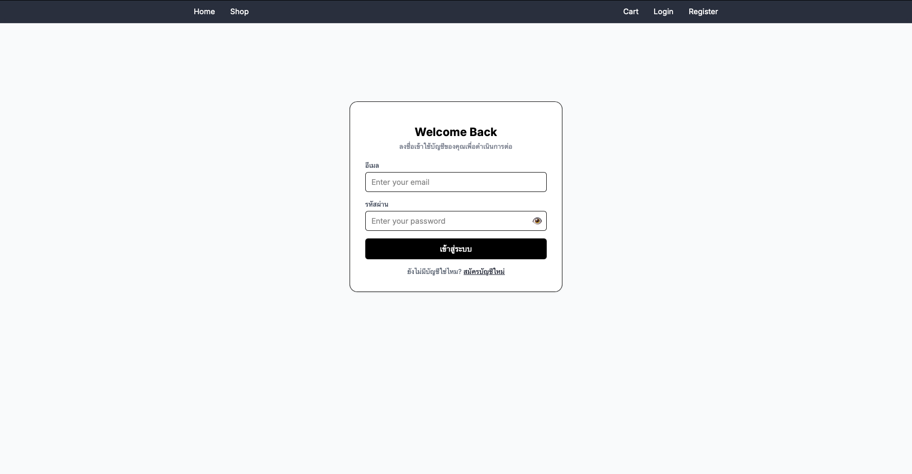
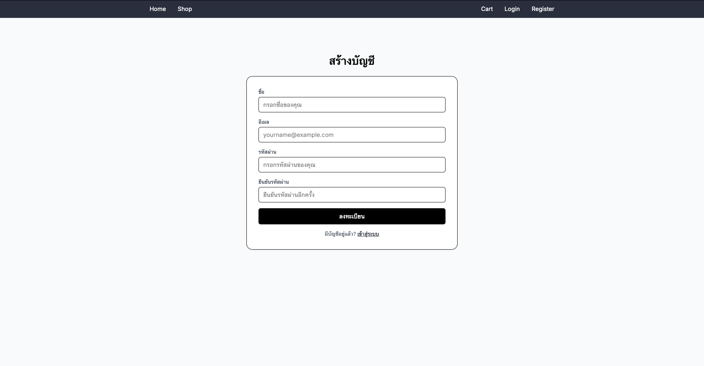
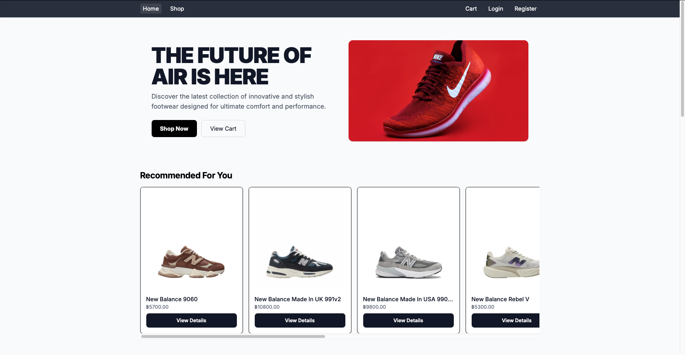
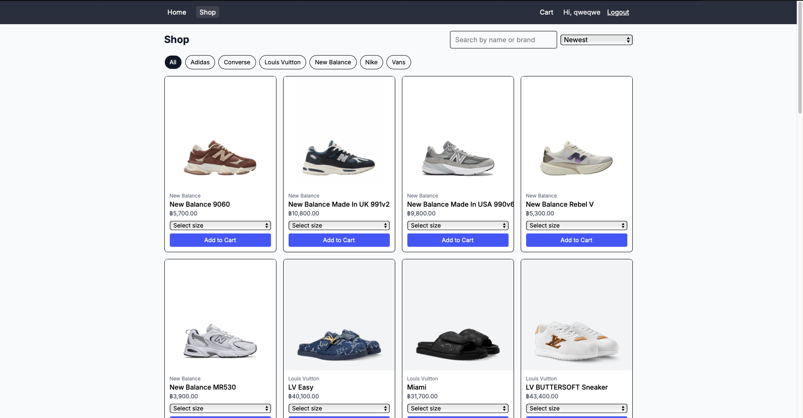
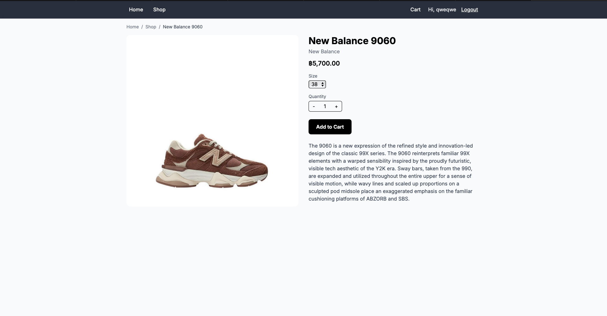
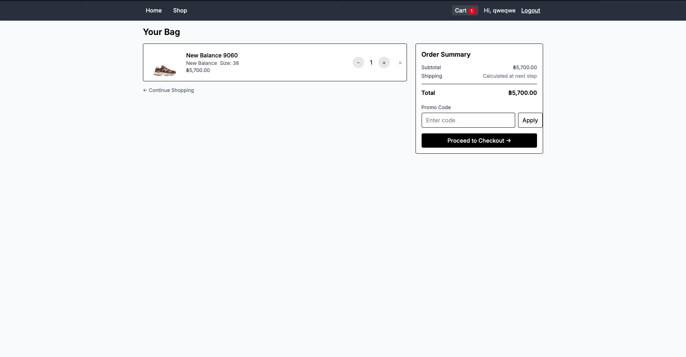
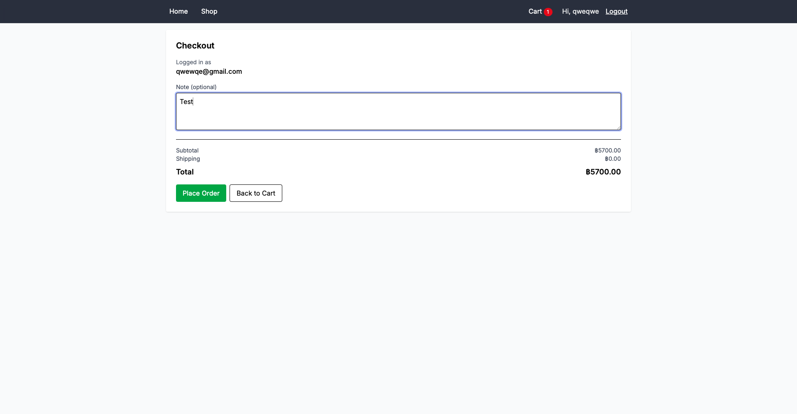
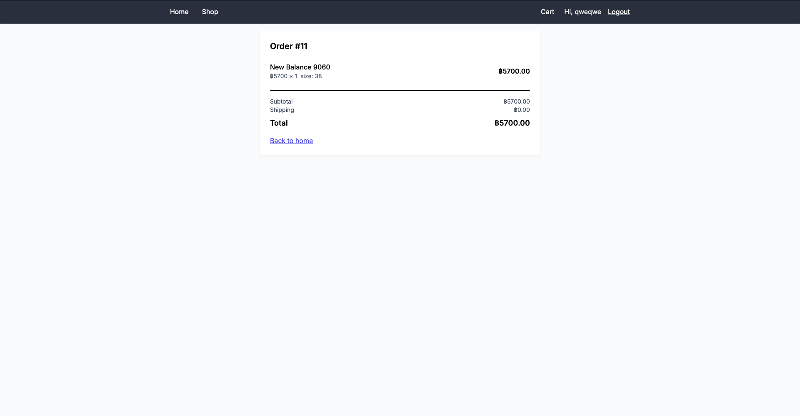
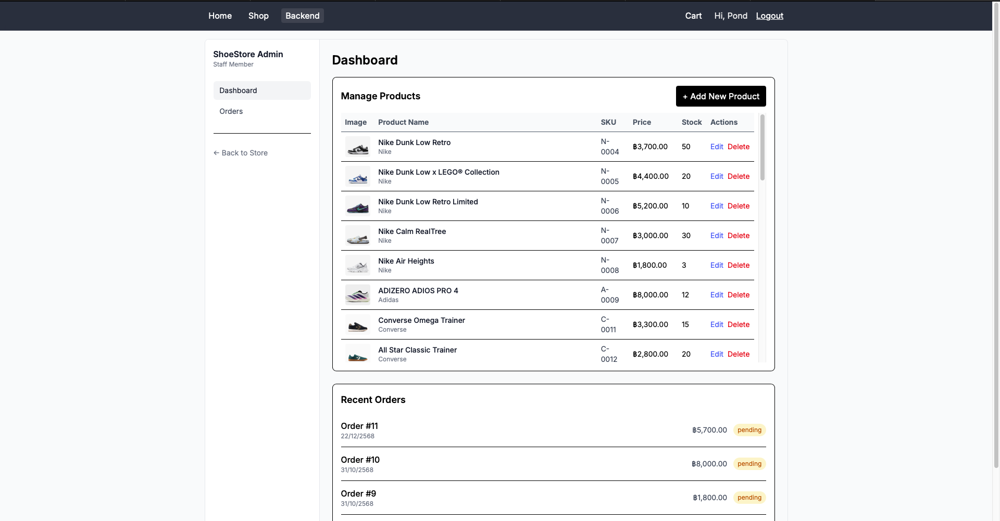
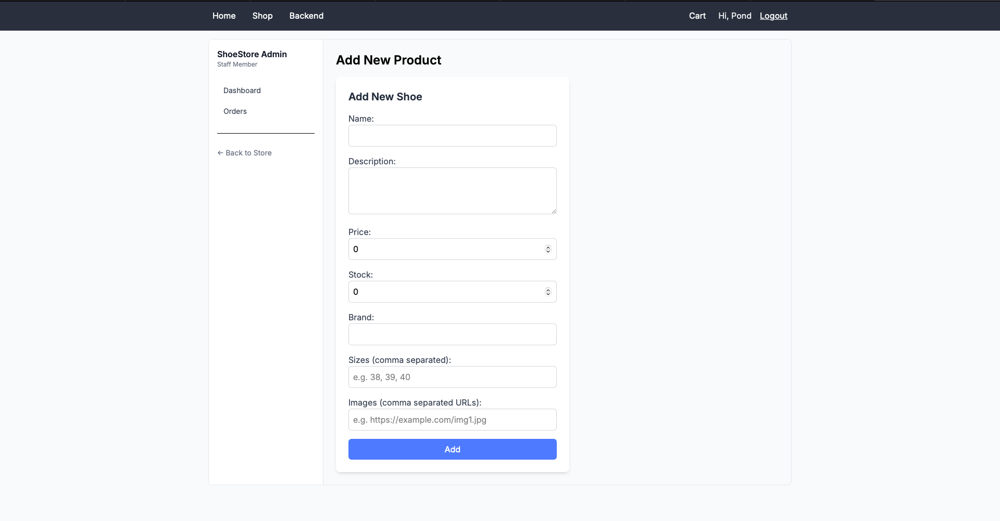

# โปรเจกต์เว็บไซต์ร้านขายรองเท้า

โปรเจกต์นี้เป็นเว็บไซต์ร้านขายรองเท้า  
พัฒนาขึ้นเพื่อฝึกการสร้างระบบเว็บไซต์แบบแยกฝั่ง Backend และ Frontend  
สามารถจัดการข้อมูลสินค้า และแสดงผลสินค้าให้ผู้ใช้งานผ่านหน้าเว็บไซต์ได้

---

## วิธีการติดตั้ง

### รันฝั่ง Database / Backend

นำไฟล์ `.sql` ไป import เข้าฐานข้อมูลที่ใช้งานก่อน  
จากนั้นรันคำสั่งต่อไปนี้

```bash
cd "Web project"
cd database
npm install
npm start
```

### รันฝั่ง Fontend
```bash
cd "Web project"
cd Shoe_store
npm install
npm run dev
```

# อธิบายโปรเจกต์และฟังก์ชั่นการใช้งาน

## Tools / ภาษาที่ใช้

### เครื่องมือที่ใช้งานในการพัฒนา
- ChatGPT
- GitHub Copilot
- Visual Studio Code
- Postman
- MySQL / PHPMyAdmin
- React

### ภาษาที่ใช้ในการพัฒนา
- TypeScript
- HTML
- CSS + Tailwind CSS

## หน้าเว็ป

### หน้า Login page


หน้าเข้าสู่ระบบสำหรับผู้ใช้งานและผู้ดูแลระบบ

### หน้า Register page


หน้าสมัครสมาชิกสำหรับผู้ใช้งานใหม่
ระบบจะบันทึกข้อมูลผู้ใช้ลงฐานข้อมูล

### หน้า Home page


หน้าหลักสำหรับผู้ใช้งาน
แสดงสินค้าและเมนูการใช้งานต่าง ๆ

### หน้าเลือกดูสินค้า


หน้าแสดงรายการสินค้าตามหมวดหมู่
ผู้ใช้สามารถเลือกดูรองเท้าที่สนใจได้

### หน้ารายละเอียดสินค้า


หน้าแสดงรายละเอียดสินค้า
สามารถเพิ่มสินค้าเข้าสู่ตะกร้าได้

### หน้าตะกร้าสินค้า


หน้าจัดการตะกร้าสินค้า
ผู้ใช้สามารถลบสินค้า หรือยืนยันการสั่งซื้อได้

### หน้าชำระเงิน


หน้าสำหรับยืนยันการชำระเงินของลูกค้า

### หน้าสลิปจ่ายเงิน


แสดงหลักฐานการชำระเงินหลังจากทำรายการสำเร็จ

### หน้าแอดมิน


หน้าเมนูสำหรับผู้ดูแลระบบ (Admin)

### หน้าดูสต๊อกสินค้าที่เหลือ


หน้าแสดงและจัดการจำนวนสินค้าที่เหลืออยู่ในคลัง

### หน้าเพิ่มสินค้า


หน้าสำหรับเพิ่มสินค้าใหม่เข้าสู่ระบบ
